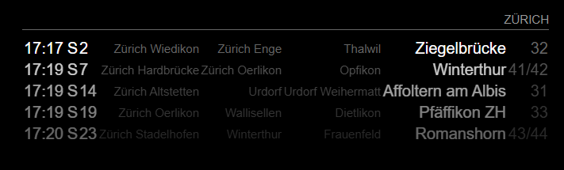
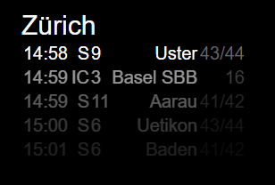
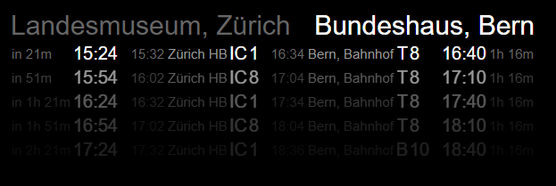
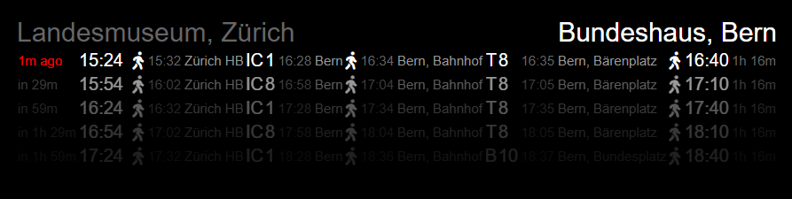
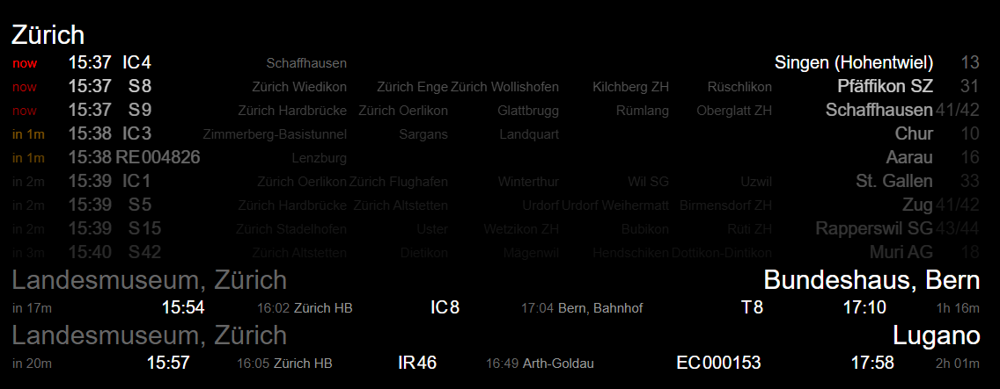

# MMM-timetable-switzerland

Public transportation timetable for Switzerland based on http://transport.opendata.ch/

## Installation

```shell
# go to the MagicMirror installation
cd MagicMirror

# go to the modules directory
cd modules

# clone the git repository
git clone https://github.com/eobermuhlner/MMM-timetable-switzerland.git
```

## Configuration

In the `MagicMirror/config/config.js` files you need to add the module and configure the timetables you want to see.

Each timetable entry is one of the following types:
- `stationboard` : show all public transport leaving a specified station
- `connections` : show all connections between two specified stations or addresses

### Stationboard

Show all public transport leaving a specified station.

Edit the `MagicMirror/config/config.js` file to add a new module entry:
```json5
  modules: [
    {
      module: 'MMM-timetable-switzerland',
      position: 'top_right',
      config: {
        timetables: [
          {
            type: 'stationboard',
            station: 'Zürich'
          }
        ],
      }
    }
  ],
```

Mandatory configurations for the `stationboard` are:
- `station` : The station to show all outgoing public transport

Optional configurations can be added at the top level or on the specific timetable entry:
- `transportations: null`<br>
  Limit transportation types to one or more of the following:<br>
  `[ 'train', 'tram', 'ship', 'bus', 'cableway' ]`
- `limit: 5`<br>
  Limit displayed number of entries.
- `opacityFactor: 0.6`<br>
  Fade out later entries by this factor.
- `timeFormat: "HH:mm`<br>
  Time format to display.
- `showDepartedMinutes: 0`
  <br>Show already departed connections for x minutes.
- `showFrom: false`<br>
  Show the name of the departure station.
- `showTo: false`<br>
  Show the name of the final station.
- `showNextStops: 3`<br>
  Show the number of next stops.
- `showWalk: false`<br>
  Show the walking parts of the connection.
- `showTimeUntilDeparture: true`<br>
  Show the relative time until departure (e.g. "in 2m").
- `showTimeUntilDepartureRedLessThanMinutes: 1`<br>
  Show the relative time until departure in _red_ when less than x minutes.
- `showTimeUntilDepartureOrangeLessThanMinutes: 2`<br>
  Show the relative time until departure in _orange_ when less than x minutes.

### Connections

Show all connections between two specified stations or addresses.

Edit the `MagicMirror/config/config.js` file to add a new module entry:
```json5
  modules: [
    {
      module: 'MMM-timetable-switzerland',
      position: 'top_right',
      config: {
        timetables: [
          {
            type: 'connections',
            from: 'Landesmuseum, Zürich', // from station or address
            to: 'Bundeshaus, Bern' // target station or address
          }
        ],
      }
    }
  ],
```

Mandatory configurations for the `connections` are:
- `from` : The station or address of the start of the journey
- `to` : The station or address of the end of the journey

Optional configurations can be added at the top level or on the specific timetable entry:
- `transportations: null`<br>
  Limit transportation types to one or more of the following:<br>
  `[ 'train', 'tram', 'ship', 'bus', 'cableway' ]`
- `limit: 5`<br>
  Limit displayed number of entries.
- `opacityFactor: 0.6`<br>
  Fade out later entries by this factor.
- `timeFormat: "HH:mm`<br>
  Time format to display.
- `showDepartedMinutes: 0`
  <br>Show already departed connections for x minutes.
- `showFrom: false`<br>
  Show the name of the departure station.
- `showTo: false`<br>
  Show the name of the final station.
- `showWalk: false`<br>
  Show the walking parts of the connection.
- `showTimeUntilDeparture: true`<br>
  Show the relative time until departure (e.g. "in 2m").
- `showTimeUntilDepartureRedLessThanMinutes: 1`<br>
  Show the relative time until departure in _red_ when less than x minutes.
- `showTimeUntilDepartureOrangeLessThanMinutes: 2`<br>
  Show the relative time until departure in _orange_ when less than x minutes.

### Default Configuration

The following values are the default configuration:

```json5
  refreshMinutes: 5,  // request timetable every x minutes
  timetables: [
    {
      type: "connections",
      from: "Landesmuseum, Zürich",
      to: "Bundeshaus, Bern",
      limitDisplay: 4,
    },
    {
      type: "stationboard",
      station: "Zürich",
      limitDisplay: 8,
      opacityFactor: 0.8,
      transportations: [ 'train' ]
    }
  ],
  requestLimit: 10, // Limit requested number of entries (should be at least `limit`)
  transportations: null, // Limit transportation types to some of the following: [ 'train', 'tram', 'ship', 'bus', 'cableway' ]
  limit: 5, // Limit displayed number of entries (must be lower or equal to `requestLimit`)
  opacityFactor: 0.6, // Fade out later entries by this factor
  timeFormat: "HH:mm", // Time format to display
  showDepartedMinutes: 0, // Show already departed connections for x minutes
  showFrom: false, // Show the name of the departure station
  showTo: false, // Show the name of the final station
  showWalk: false, // Show the walking parts of the connection
  showNextStops: 3, // Show the number of next stops in "stationboard"
  showTimeUntilDeparture: true, // Show the relative time until departure (e.g. "in 2m")
  showTimeUntilDepartureRedLessThanMinutes: 1, // Show the relative time until departure in _red_ when less than x minutes
  showTimeUntilDepartureOrangeLessThanMinutes: 2 // Show the relative time until departure in _orange_ when less than x minutes
```

## Screenshots

### Stationboard

```json5
      config: {
        timetables: [
          {
            type: 'stationboard',
            station: 'Zürich'
          }
        ]
      }
```



```json5
      config: {
        timetables: [
          {
            type: 'stationboard',
            station: 'Zürich',
            showNextStops: 0,
            showTimeUntilDeparture: false
          }
        ]
      }
```



### Connections

```json5
      config: {
        timetables: [
          {
            type: "connections",
            from: 'Landesmuseum, Zürich', // from station or address
            to: 'Bundeshaus, Bern' // target station or address
          }
        ]
      }
```



```json5
      config: {
        timetables: [
          {
            type: "connections",
            from: 'Landesmuseum, Zürich', // from station or address
            to: 'Bundeshaus, Bern', // target station or address
            showWalk: true,
            showDepartedMinutes: 2
          }
        ]
      }
```



### Multiple Timetables

```json5
      config: {
        timetables: [
          {
            type: 'stationboard',
            station: 'Zürich',
            showNextStops: 5,
            limit: 10,
            opacityFactor: 0.8
          },
          {
            type: "connections",
            from: 'Landesmuseum, Zürich',
            to: 'Bundeshaus, Bern',
            limit: 1
          },
          {
            type: "connections",
            from: 'Landesmuseum, Zürich',
            to: 'Lugano',
            limit: 1
          },
      ],
```



