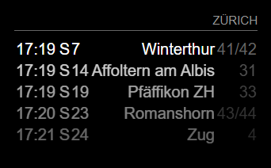
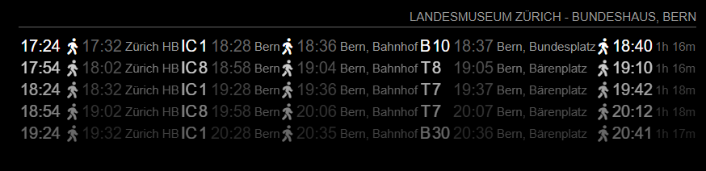

# MMM-timetable-switzerland

Public transportation timetable for Switzerland based on http://transport.opendata.ch/

## Installation

```shell
# go to the MagicMirror installation
cd MagicMirror

# go to the modules directory
cd modules

# clone the git repository
git clone https://github.com/eobermuhlner/MMM-timetable-switzerland.git
```

## Configuration

In the `MagicMirror/config/config.js` files you need to add the module and configure the timetables you want to see.

Each timetable entry is one of the following types:
- `stationboard` : show all public transport leaving a specified station
- `connections` : show all connections between two specified stations or addresses

### Stationboard

Show all public transport leaving a specified station.

Edit the `MagicMirror/config/config.js` file:
```json5
  modules: [
    {
      module: 'MMM-timetable-switzerland',
      position: 'top_right',
      config: {
        timetables: [
          type: 'stationboard',
          station: 'Zürich'
        ],
      }
    }
  ],
```

Mandatory configurations for the `stationboard` are:
- `station` : The station to show all outgoing public transport

### Connections

Show all connections between two specified stations or addresses.

Edit the `MagicMirror/config/config.js` file:
```json5
  modules: [
    {
      module: 'MMM-timetable-switzerland',
      position: 'top_right',
      config: {
        timetables: [
          type: 'connections',
          from: 'Landesmuseum, Zürich', // from station or address
          to: 'Bundeshaus, Bern' // target station or address
        ],
      }
    }
  ],
```

The shown connections will include the estimated walking times.
Use the `showWalk: true` option to show the details of the walking parts.

### Default Configuration

The following values are the default configuration:

```json5
  refreshHours: 0, // request timetable every x hours (plus refreshMinutes)
  refreshMinutes: 5,  // request timetable every x minutes (plus refreshHours)
  refreshScreenMinutes: 0, // refresh screen timetable every x minutes (plus refreshScreenSeconds)
  refreshScreenSeconds: 1, // refresh screen timetable every x seconds (plus refreshScreenSeconds)
  timetables: [
    {
      type: "connections",
      from: "Landesmuseum, Zürich",
      to: "Bundeshaus, Bern",
      limitDisplay: 4,
    },
    {
      type: "stationboard",
      station: "Zürich",
      limitDisplay: 8,
      opacityFactor: 0.8,
      transportations: [ 'train' ]
    }
  ],
  limit: 10, // limit requested number of entries (should be at least limitDisplay)
  transportations: null, // limit transpartation types to some of the following: [ 'train', 'tram', 'ship', 'bus', 'cableway' ]
  limitDisplay: 5, // limit displayed number of entries
  opacityFactor: 0.6, // fade out later entries by this factor
  timeFormat: "HH:mm", // time format to display
  showFrom: false, // show the name of departure station
  showTo: false, // show the name of arrival station
  showWalk: false, // show the walking parts of the connection
  showNextStops: 3, // show the number of next stops in "stationboard"
  showTimeUntilDeparture: true, // show the relative time until departure (e.g. "in 2m 15s")
  showTimeUntilDepartureLessThanMinutes: 60, // show the relative time until departure when less than x minutes
  showTimeUntilDepartureRedLessThanMinutes: 1, // show the relative time until departure in _red_ when less than x minutes
  showTimeUntilDepartureOrangeLessThanMinutes: 2 // show the relative time until departure in _orange_ when less than x minutes
```

## Screenshots

### Stationboard

```json5
      config: {
        type: 'stationboard',
        station: 'Zürich'
      }
```


```json5
      config: {
        type: 'stationboard',
        station: 'Zürich',
        showNextStops: 0
      }
```



### Connections

```json5
      config: {
        type: "connections",
        from: 'Landesmuseum,Zürich', // from station or address
        to: 'Bundeshaus,Bern' // target station or address
      }
```


```json5
      config: {
        type: "connections",
        from: 'Landesmuseum,Zürich', // from station or address
        to: 'Bundeshaus,Bern', // target station or address
        showWalk: true
      }
```




